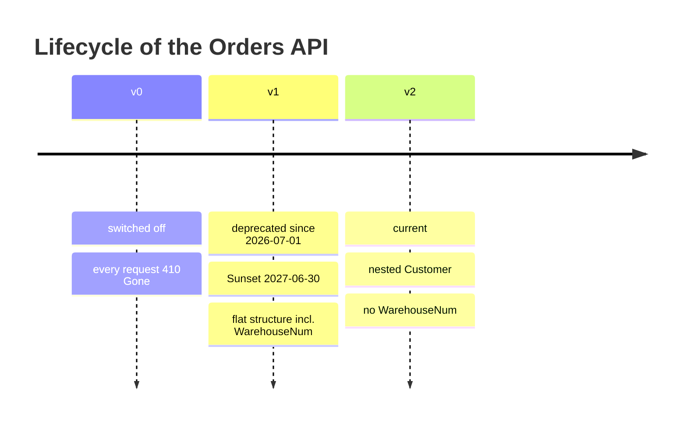
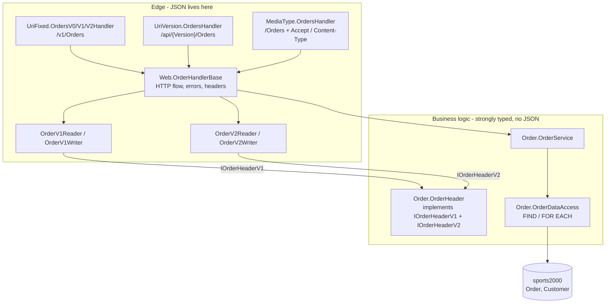
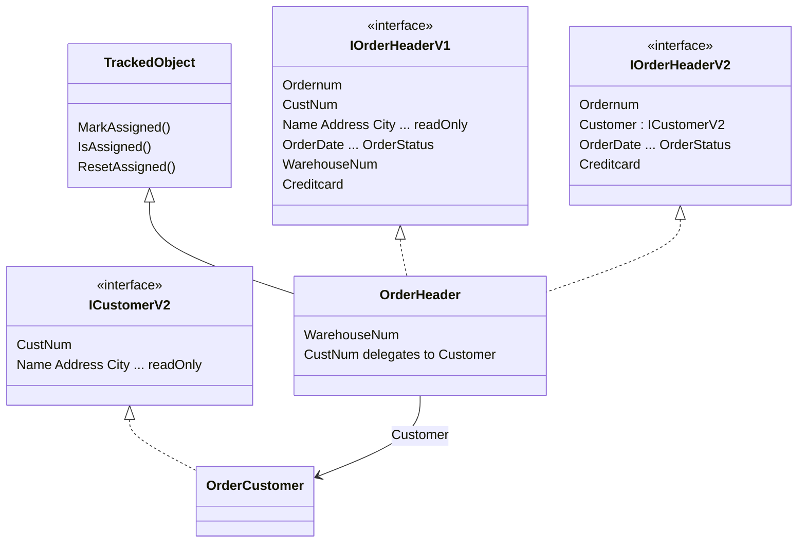
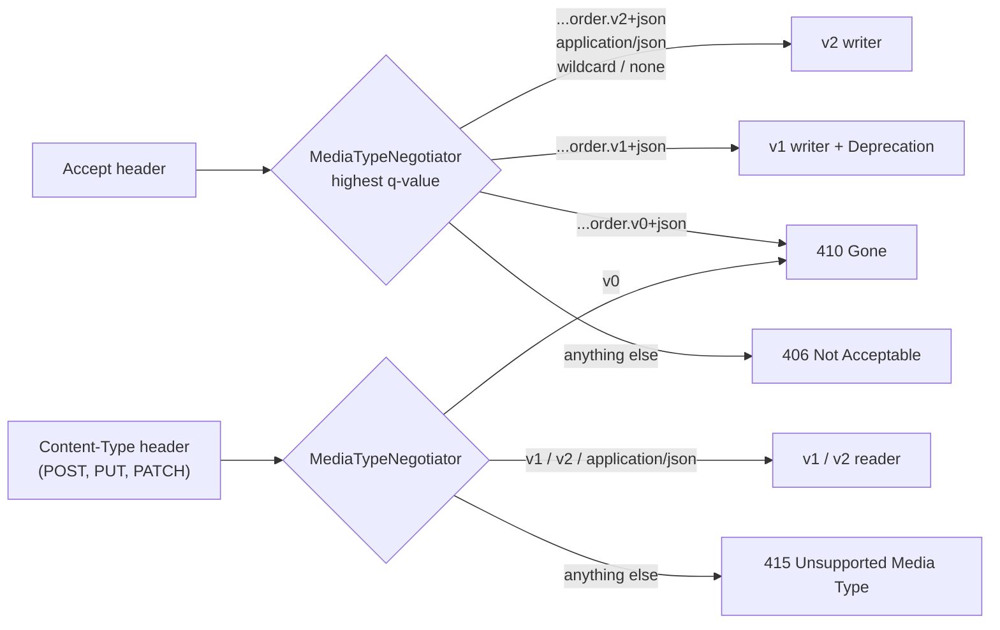
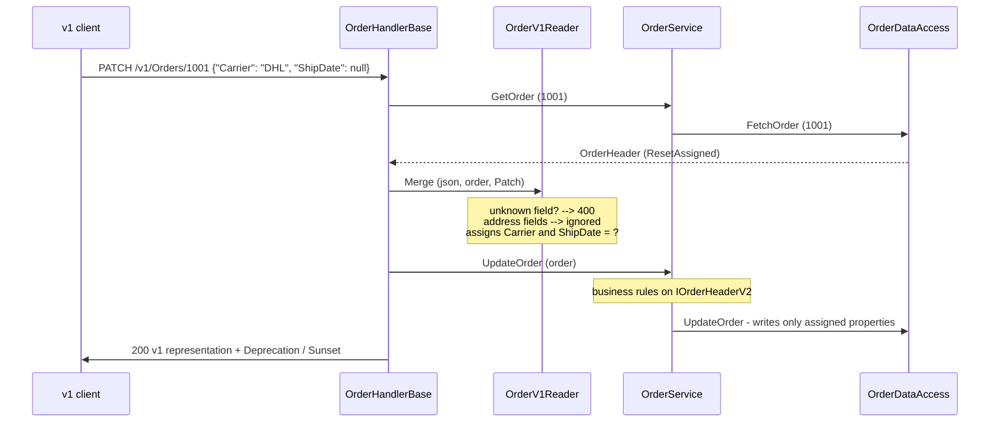

# REST API Versioning - Concepts and Samples

Sample code for the talk **"REST API Versioning: Concepts and Samples"** (PUG Challenge).
A versioned REST API for the order header of the OpenEdge `sports2000` database, built
on plain PASOE web handlers in ABL.

The samples show:

- **three API versions** side by side: v0 switched off, v1 deprecated, v2 current
- **two addressing variants**: the version in the URI (`/v1/Orders`) and the version in
  the media type (`Accept: application/vnd.sports2000.order.v1+json`)
- **one business logic** for all versions. JSON exists only at the edge of the API; the
  business logic and data access only see strongly typed objects
- **API lifecycle** over HTTP: `Deprecation` / `Sunset` headers, `410 Gone` with a link to
  the successor version, `405` with `Allow`, and RFC 9457 problem details for every error
- **OpenAPI 3** documents for both variants

## Contents

- [The API](#the-api)
- [The versions](#the-versions)
- [Architecture: one business logic, many contracts](#architecture-one-business-logic-many-contracts)
- [Addressing variants](#addressing-variants)
- [Writes: read - merge - write](#writes-read---merge---write)
- [Errors](#errors)
- [OpenAPI](#openapi)
- [Package layout](#package-layout)
- [Deployment](#deployment)
- [Requirements and dependencies](#requirements-and-dependencies)

## The API

The order header (table `Order`) plus the address of its customer (table `Customer`).

| Method | URI                  | Purpose                                                        |
|--------|----------------------|----------------------------------------------------------------|
| GET    | `/Orders`            | page of orders (`?skip=0&top=10`, top max. 100)                 |
| GET    | `/Orders/{Ordernum}` | one order                                                      |
| POST   | `/Orders`            | create an order: `201 Created` with a `Location` header        |
| PUT    | `/Orders/{Ordernum}` | replace an order: the complete writable representation         |
| PATCH  | `/Orders/{Ordernum}` | change single fields: only the fields in the payload change, `null` sets the unknown value |
| DELETE | any                  | never allowed, in no version: `405` with `Allow`               |

Rules for every write (POST, PUT, PATCH) in every version:

- a field that is not part of the schema of the version: `400 Bad Request`, naming the field(s)
- the address fields are read-only: they are known, but ignored. Only `CustNum` counts.

## The versions



| Version | Status | Representation |
|---|---|---|
| v0 | **switched off** | No implementation left. Every request returns `410 Gone` with problem details and a `Link: <...v2...>; rel="successor-version"` header when a record is addressed. |
| v1 | **deprecated** | Flat: the 15 fields of `Order` plus `Name`, `Address`, `Address2`, `PostalCode`, `City`, `State`, `Country`. Every response carries `Deprecation: @1782864000` (RFC 9745), `Sunset: Wed, 30 Jun 2027 23:59:59 GMT` (RFC 8594) and `Link: <...migrate-v2>; rel="deprecation"`. |
| v2 | **current** | Two breaking changes: the customer (with `CustNum`) moves into a nested `Customer` object, and `WarehouseNum` is removed. Sending `WarehouseNum` returns `400`. |

v1:

```json
{
  "Ordernum": 1001,
  "CustNum": 3001,
  "Name": "Golden Gate Bikes",
  "Address": "1 Test Street",
  "Address2": "",
  "PostalCode": "94016",
  "City": "San Francisco",
  "State": "CA",
  "Country": "USA",
  "OrderDate": "2026-07-01",
  "ShipDate": null,
  "PromiseDate": "2026-07-15",
  "Carrier": "UPS",
  "Instructions": "",
  "PO": "PO-4711",
  "Terms": "Net30",
  "SalesRep": "BBB",
  "BillToID": 1,
  "ShipToID": 2,
  "OrderStatus": "Ordered",
  "WarehouseNum": 1,
  "Creditcard": "Visa"
}
```

v2:

```json
{
  "Ordernum": 1001,
  "Customer": {
    "CustNum": 3001,
    "Name": "Golden Gate Bikes",
    "Address": "1 Test Street",
    "Address2": "",
    "PostalCode": "94016",
    "City": "San Francisco",
    "State": "CA",
    "Country": "USA"
  },
  "OrderDate": "2026-07-01",
  "ShipDate": null,
  "PromiseDate": "2026-07-15",
  "Carrier": "UPS",
  "Instructions": "",
  "PO": "PO-4711",
  "Terms": "Net30",
  "SalesRep": "BBB",
  "BillToID": 1,
  "ShipToID": 2,
  "OrderStatus": "Ordered",
  "Creditcard": "Visa"
}
```

## Architecture: one business logic, many contracts

The central idea: there is exactly **one** implementation of the order, shaped like the
current version (v2). Each version is just a **contract** (an interface) plus a **reader**
and a **writer** at the edge.



### Contract is not database



- Properties that both versions have satisfy both interfaces.
- The flat v1 customer properties (`CustNum`, `Name`, ...) **delegate** to the nested
  `Customer` object of v2.
- `WarehouseNum` was removed from the **v2 contract**, not from the **data**. The model is the
  newest shape **plus** every field an older, still supported version needs.
  `IOrderHeaderV1` exposes it, `IOrderHeaderV2` does not - the v2 writer cannot write it
  even by accident.
- A reader or writer only sees the interface of its version (`OrderV1Reader` works through
  `IOrderHeaderV1`).
- A future v3 adds `IOrderHeaderV3` and a v3 reader/writer. The v1 code stays untouched.

## Addressing variants

### Version in the URI

1. **Fixed URIs**: one registration and one small handler per version
   (`/v0/Orders`, `/v1/Orders`, `/v2/Orders`).
2. **One handler, version as path parameter**: `/api/{Version}/Orders`. The handler is the
   service interface of the API. Its `SelectVersion` method lists all versions:

   ```
   v0 --> 410 Gone
   v1 --> OrderV1Reader / OrderV1Writer (deprecated)
   v2 --> OrderV2Reader / OrderV2Writer (current)
   other --> 404
   ```

### Version in the media type

One URI (`/Orders`). `MediaType.MediaTypeNegotiator` selects the version:



- On equal q-values, a vendor media type wins over `application/json`, which wins over a wildcard.
- The response `Content-Type` is the negotiated media type.
- Every response carries `Vary: Accept`.
- Request and response version may differ: send v1, receive v2.

## Writes: read - merge - write

Every update reads the current order first, merges the request and writes it back. So a
client never loses fields its version does not know (a v2 `PUT` keeps `WarehouseNum`).



PATCH has to tell "field missing" (do not touch it) from "field sent as `null`" (set it to
unknown). `OrderHeader` inherits `TrackedObject`: every setter records the property, and the
data access writes exactly the recorded properties.

| Method | Required fields |
|---|---|
| POST  | `CustNum` (v1) / `Customer.CustNum` (v2) |
| PUT   | the complete writable representation of the version |
| PATCH | none |

## Errors

Every error is an [RFC 9457](https://www.rfc-editor.org/rfc/rfc9457) problem details
document (`application/problem+json`):

```json
{
  "type": "about:blank",
  "title": "Unknown field",
  "status": 400,
  "detail": "The field WarehouseNum is not part of this version of the API.",
  "errors": [
    {
      "message": "The field WarehouseNum is not part of this version of the API.",
      "field": "WarehouseNum"
    }
  ]
}
```

| Status | When | Extra headers |
|---|---|---|
| 400 | unknown field, missing required field, wrong type, business rule | |
| 404 | unknown order, unknown version (`/api/v3/...`) | |
| 405 | DELETE, PUT/PATCH on the collection, POST on an order | `Allow` (RFC 9110) |
| 406 | no supported media type in `Accept` | `Vary` |
| 410 | v0 | `Link: <...>; rel="successor-version"` |
| 415 | unsupported `Content-Type` | `Vary` |

- The business logic raises plain ABL errors (`OrderNotFoundException`,
  `OrderValidationException`), using the field names of the model (`Customer.CustNum`).
- `OrderHandlerBase:ToApiError` translates them at the edge. A v1 client gets its own
  field name (`CustNum`).
- Errors of a v1 request also carry the deprecation headers.

## OpenAPI

Hand-written OpenAPI 3.0 documents in `Demo/RestApiVersioning/OpenApi/`:

| Document | Variant |
|---|---|
| `orders-mediatype.openapi.json` | media type: one `content` entry per media type for responses and request bodies. The v1 schemas are `deprecated`. |
| `orders-v2.openapi.json` | URI, v2 |
| `orders-v1.openapi.json` | URI, v1: every operation `deprecated: true` |

- The URI variant has **one document per version**. Each version has its own lifecycle,
  clients generate code against exactly one contract, and the deprecated document can be
  retired as a whole.
- Request schemas use `additionalProperties: false`.
- Address fields are `readOnly: true`.
- PATCH bodies use the same schemas without `required`.

`Web.OpenApiDocumentHandler` serves the documents (`/openapi/{Document}`) and a Swagger UI
page with a drop-down of all three (`/openapi`, Swagger UI loaded from unpkg.com).

## Package layout

All packages live under `Demo/RestApiVersioning` (package `Demo.RestApiVersioning`).

| Package | Content |
|---|---|
| `Simple` | the introduction, plain `OpenEdge.Web.WebHandler` without framework, GET only, direct record access: `SimpleOrderHandler` (a minimal web handler, no database), `SimpleOrderMediaTypeHandler` (`/simple/media/Orders/{Ordernum}`, v1 / v2 from the `Accept` header, no q-values), `SimpleOrderPathParameterHandler` (`/simple/{Version}/Orders/{Ordernum}`), `SimpleOrderJson` (v1 / v2 as field lists of the records) |
| `Order` | the ONE implementation: `IOrderHeaderV1`, `IOrderHeaderV2`, `ICustomerV2`, `OrderHeader`, `OrderCustomer`, `TrackedObject`, `OrderService`, `OrderDataAccess`, business errors |
| `Adapters` | `IOrderReader` / `IOrderWriter`, `OrderV1Reader`, `OrderV1Writer`, `OrderV2Reader`, `OrderV2Writer`, `JsonReader` (unknown / required fields, typed getters), `MergeMode` |
| `Web` | `OrderHandlerBase` (the HTTP flow), `OpenApiDocumentHandler` |
| `UriFixed` | `OrdersV0Handler`, `OrdersV1Handler`, `OrdersV2Handler` |
| `UriVersion` | `OrdersHandler` - version as path parameter |
| `MediaType` | `OrdersHandler`, `MediaTypeNegotiator` |
| `Errors` | the HTTP errors (`IHttp<nnn>Error` marker interfaces select the status code) |
| `OpenApi` | the OpenAPI documents and the Swagger UI page |
| `Deployment` | sample `ROOT.handlers`, `openedge.properties` (12.2) and `oeablSecurity.csv` |

`Demo/RestApiVersioning/demo-script.md` has the curl commands of the live demo, with the
expected status codes.

## Deployment

1. Put the folder that **contains** `Demo/` (the root of this repository) on the PROPATH of the
   PASOE ABL application and compile `Demo/RestApiVersioning`. The package names
   (`Demo.RestApiVersioning.*`) require this relative folder structure. `sports2000` must be
   connected.
2. Register the web handlers:
   - Releases with `webapps/ROOT/WEB-INF/adapters/web/ROOT/ROOT.handlers` (e.g. OpenEdge 12.8):
     add the entries of `Demo/RestApiVersioning/Deployment/ROOT.handlers`.
   - Releases that register web handlers in `conf/openedge.properties` (e.g. OpenEdge 12.2):
     add the `handlerN=` entries of `Demo/RestApiVersioning/Deployment/openedge.properties`.
   - The first matching URI wins, so `/Orders/{Ordernum}` is registered before `/Orders`.
3. Allow access in `webapps/ROOT/WEB-INF/oeablSecurity.csv`. `Demo/RestApiVersioning/Deployment/oeablSecurity.csv`
   uses `permitAll()` for the demo. Use your authentication for anything real.

Then open `http://localhost:8820/web/openapi` and run `Demo/RestApiVersioning/demo-script.md`.

## Requirements and dependencies

- OpenEdge 12.2 or later. The classes in `Demo/RestApiVersioning/Simple` use the `VAR` statement and need 12.3+.
- The `sports2000` database.
- The **SmartComponent Library** (Consultingwerk) provides the error handling of the web handlers:
  - `Consultingwerk.OERA.JsdoGenericService.WebHandler.SmartWebHandler` (base class of
    `OrderHandlerBase`)
  - `Rfc7807WebErrorHandler` (problem details)
  - the `IHttp<nnn>Error` marker interfaces
  - `HttpMethodNotAllowedException`
  - `Consultingwerk.Exceptions.Exception` / `IErrorTitle`

  To use the pattern without it, derive `OrderHandlerBase` from `OpenEdge.Web.WebHandler`
  and write the problem details JSON in `HandleException`. The `Order` and `Adapters`
  packages do not depend on it (apart from the `Errors` they raise).
- The automated tests (SmartUnit) live in the SmartComponent Library repository
  (`Consultingwerk.Web2Tests.RestApiVersioning`) and are not part of this repository.

## License

Copyright (c) 2026 Consultingwerk Ltd. Sample code, distributed "AS IS", without warranty of
any kind.
